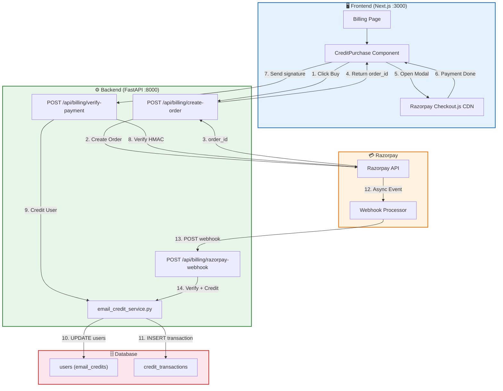
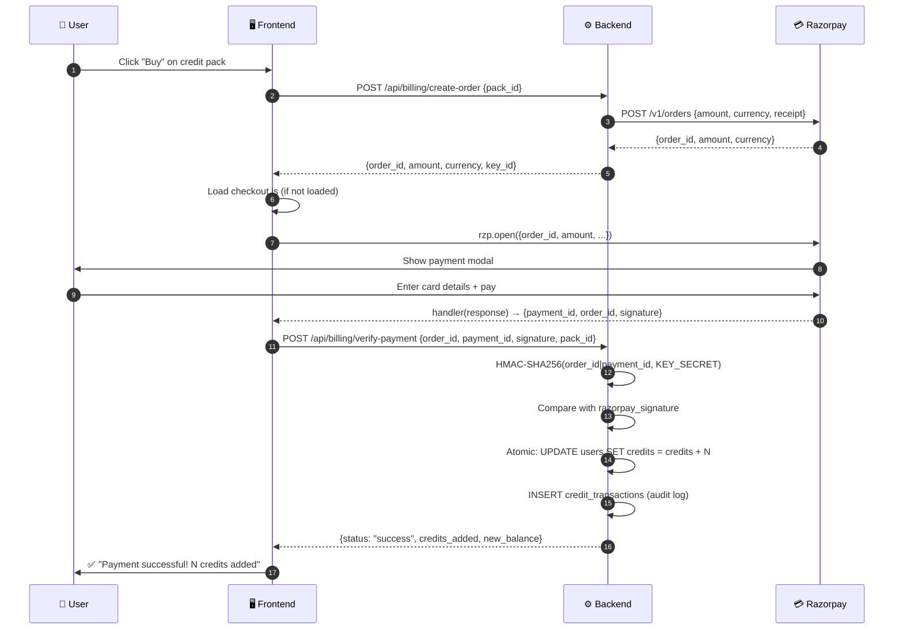
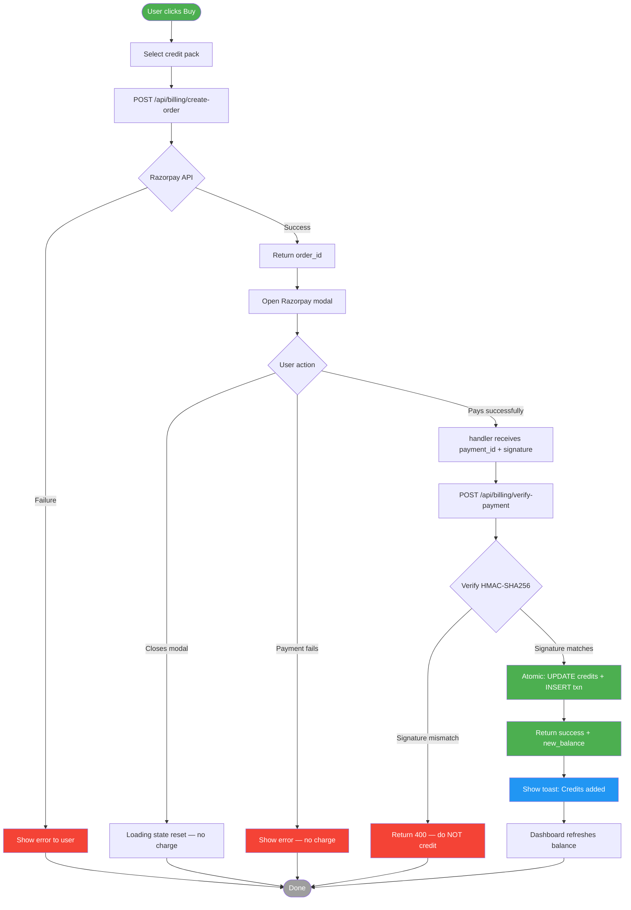
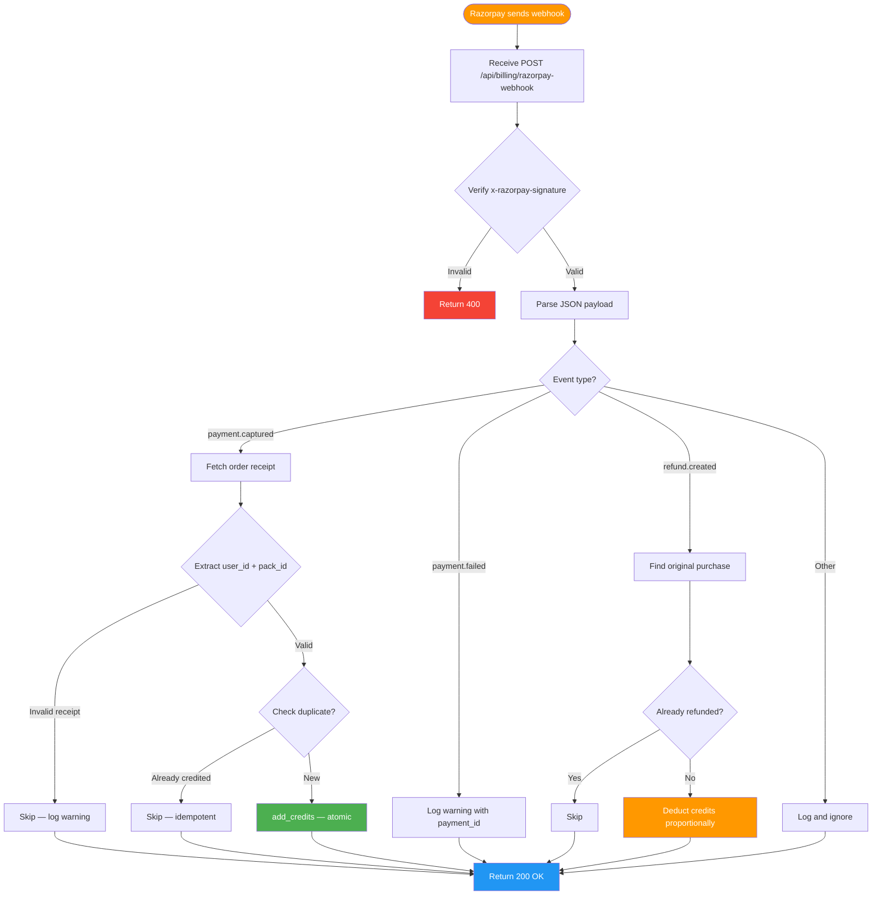
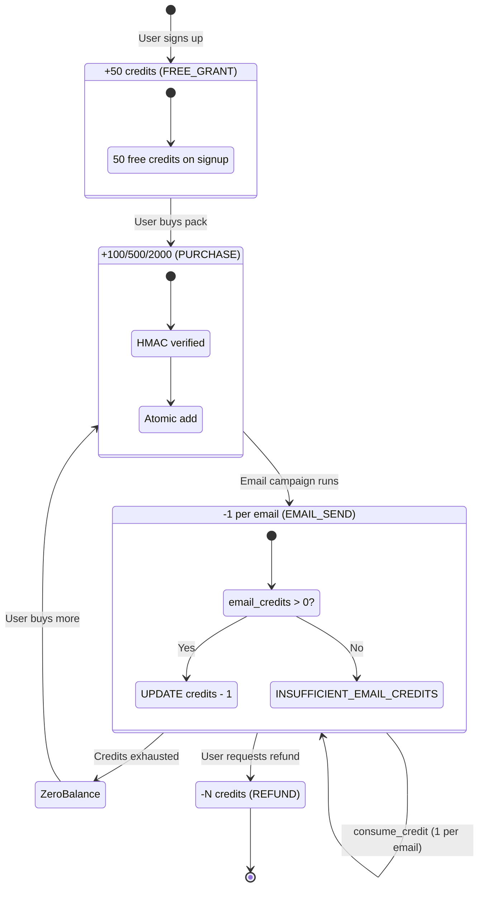
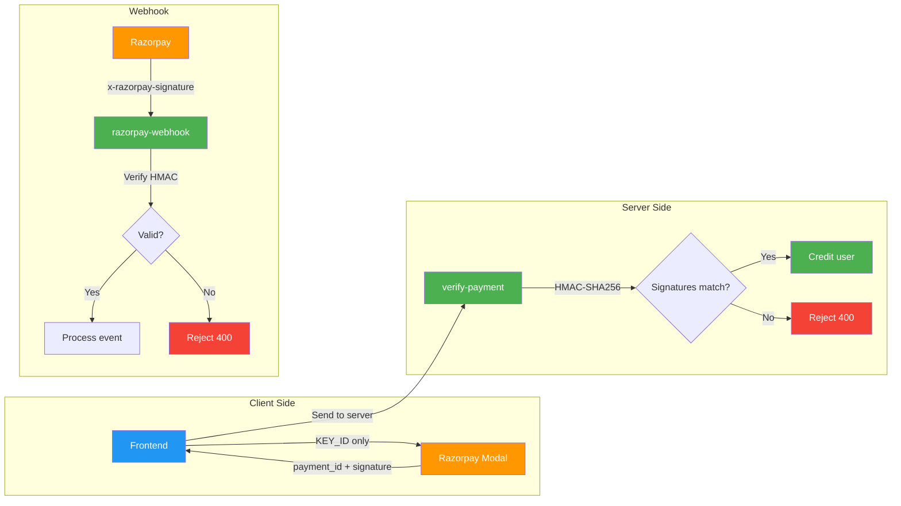

# Razorpay Payment Integration — Implementation Document

## Table of Contents

1. [Overview](#1-overview)
2. [High-Level Design (HLD)](#2-high-level-design-hld)
3. [Low-Level Design (LLD)](#3-low-level-design-lld)
4. [Flow Diagrams](#4-flow-diagrams)
5. [API Reference](#5-api-reference)
6. [Credit System](#6-credit-system)
7. [Security](#7-security)
8. [Error Handling](#8-error-handling)
9. [Webhook Integration](#9-webhook-integration)
10. [Testing Guide](#10-testing-guide)

---

## 1. Overview

Razorpay Standard Checkout is integrated into Codessy to sell **email credit packs**. Users purchase credits via a payment modal, and credits are atomically added to their account after signature verification. A webhook handles server-side reconciliation for failed/delayed client confirmations.

### Tech Stack

| Layer | Technology |
|-------|-----------|
| Backend | FastAPI (Python 3.9) |
| Frontend | Next.js (Pages Router) |
| Payment SDK | `razorpay` Python package v2.0.1 |
| Database | SQLAlchemy + SQLite (dev) / PostgreSQL (prod) |

### Credit Packs

| Pack | Credits | Price (₹) | Per Credit |
|------|---------|-----------|------------|
| Starter | 100 | 499 | ₹4.99 |
| Growth | 500 | 1,999 | ₹4.00 |
| Scale | 2,000 | 6,999 | ₹3.50 |

---

## 2. High-Level Design (HLD)

### 2.1 System Architecture



### 2.2 Payment Flow (Happy Path)



---

## 3. Low-Level Design (LLD)

### 3.1 Database Schema

```sql
-- users table (new column)
ALTER TABLE users ADD COLUMN email_credits INTEGER NOT NULL DEFAULT 0;

-- credit_transactions table (new)
CREATE TABLE credit_transactions (
    id            INTEGER PRIMARY KEY,
    user_id       INTEGER NOT NULL REFERENCES users(id),
    type          VARCHAR(32) NOT NULL,   -- FREE_GRANT | PURCHASE | EMAIL_SEND | REFUND
    amount        INTEGER NOT NULL,       -- positive = add, negative = deduct
    reference_id  VARCHAR(255) DEFAULT '',-- payment_id, refund_id, etc.
    description   TEXT DEFAULT '',
    balance_after INTEGER NOT NULL,       -- snapshot after this txn
    created_at    DATETIME
);

CREATE INDEX ix_credit_transactions_user_id ON credit_transactions(user_id);
CREATE INDEX ix_credit_transaction_user_type ON credit_transactions(user_id, type);
```

### 3.2 Backend Config

```python
# backend/config.py
import os
from dotenv import load_dotenv

load_dotenv()

RAZORPAY_KEY_ID = os.getenv('RAZORPAY_KEY_ID', '')
RAZORPAY_KEY_SECRET = os.getenv('RAZORPAY_KEY_SECRET', '')
RAZORPAY_WEBHOOK_SECRET = os.getenv('RAZORPAY_WEBHOOK_SECRET', '')
```

```bash
# backend/.env
RAZORPAY_KEY_ID=rzp_test_TgkyHIhn2r8LM8
RAZORPAY_KEY_SECRET=imep174yzmjQwWlC1qr4fWDl
RAZORPAY_WEBHOOK_SECRET=your_webhook_secret_here
```

### 3.3 Credit Service (Atomic Operations)

```python
# backend/email_credit_service.py (core functions)

def consume_credit(db, user_id, reference_id='', description=''):
    """Atomic deduction — only succeeds if credits > 0."""
    result = db.execute(
        text('UPDATE users SET email_credits = email_credits - 1 '
             'WHERE id = :user_id AND email_credits > 0'),
        {'user_id': user_id},
    )
    if result.rowcount == 0:
        return False, 0  # insufficient credits

    db.flush()
    db.expire(db.query(User).filter(User.id == user_id).first())
    user = db.query(User).filter(User.id == user_id).first()
    remaining = user.email_credits

    transaction = CreditTransaction(
        user_id=user_id, type='EMAIL_SEND', amount=-1,
        reference_id=reference_id, description=description,
        balance_after=remaining,
    )
    db.add(transaction)
    db.flush()
    return True, remaining


def add_credits(db, user_id, amount, tx_type, reference_id='', description=''):
    """Atomic addition — used for purchases, grants, refunds."""
    db.execute(
        text('UPDATE users SET email_credits = email_credits + :amount '
             'WHERE id = :user_id'),
        {'user_id': user_id, 'amount': amount},
    )
    db.flush()
    db.expire(db.query(User).filter(User.id == user_id).first())
    user = db.query(User).filter(User.id == user_id).first()
    new_balance = user.email_credits

    transaction = CreditTransaction(
        user_id=user_id, type=tx_type, amount=amount,
        reference_id=reference_id,
        description=description or f'{tx_type}: +{amount} credits',
        balance_after=new_balance,
    )
    db.add(transaction)
    db.flush()
    return True, new_balance
```

### 3.4 Backend Endpoints

#### Create Order

```python
# backend/routers/billing.py

import razorpay

CREDIT_PACKS = [
    {'id': 'starter',  'credits': 100,   'amount': 49900,  'label': 'Starter — 100 credits'},
    {'id': 'growth',   'credits': 500,   'amount': 199900, 'label': 'Growth — 500 credits'},
    {'id': 'scale',    'credits': 2000,  'amount': 699900, 'label': 'Scale — 2000 credits'},
]

@router.post('/create-order')
def create_order(payload: CreateOrderRequest, user: User = Depends(get_current_user)):
    pack = next((p for p in CREDIT_PACKS if p['id'] == payload.pack_id), None)
    if not pack:
        raise HTTPException(status_code=400, detail='Invalid pack ID')

    client = razorpay.Client(auth=(RAZORPAY_KEY_ID, RAZORPAY_KEY_SECRET))
    order = client.order.create({
        'amount': pack['amount'],          # in paise
        'currency': 'INR',
        'receipt': f'user_{user.id}_{pack["id"]}',
        'notes': {'user_id': str(user.id), 'pack_id': pack['id']},
    })

    return {
        'order_id': order['id'],
        'amount': pack['amount'],
        'currency': 'INR',
        'key_id': RAZORPAY_KEY_ID,         # safe to expose (public key)
    }
```

#### Verify Payment

```python
@router.post('/verify-payment')
def verify_payment(payload: VerifyPaymentRequest,
                   user: User = Depends(get_current_user),
                   db: Session = Depends(get_db)):
    # 1. Validate pack
    pack = next((p for p in CREDIT_PACKS if p['id'] == payload.pack_id), None)
    if not pack:
        raise HTTPException(status_code=400, detail='Invalid pack ID')

    # 2. Verify HMAC signature
    expected = hmac.new(
        RAZORPAY_KEY_SECRET.encode(),
        f'{payload.razorpay_order_id}|{payload.razorpay_payment_id}'.encode(),
        hashlib.sha256,
    ).hexdigest()

    if not hmac.compare_digest(expected, payload.razorpay_signature):
        raise HTTPException(status_code=400, detail='Invalid payment signature')

    # 3. Credit user (atomic)
    success, new_balance = add_credits(
        db, user.id, pack['credits'], PURCHASE_TYPE,
        reference_id=payload.razorpay_payment_id,
        description=f'Purchased {pack["credits"]} credits',
    )
    db.commit()
    return {'status': 'success', 'credits_added': pack['credits'], 'new_balance': new_balance}
```

#### Webhook Handler

```python
@router.post('/razorpay-webhook')
async def razorpay_webhook(request: Request, db: Session = Depends(get_db)):
    body = await request.body()
    signature = request.headers.get('x-razorpay-signature', '')

    # 1. Verify webhook signature
    if not _verify_webhook_signature(body, signature):
        raise HTTPException(status_code=400, detail='Invalid webhook signature')

    payload = json.loads(body)
    event = payload.get('event', '')

    # 2. Route by event type
    if event == 'payment.captured':
        # Idempotent credit via order receipt → user_id lookup
        ...
    elif event == 'payment.failed':
        # Log failure
        ...
    elif event in ('refund.created', 'refund.processed'):
        # Deduct credits proportionally
        ...

    return {'status': 'ok'}
```

### 3.5 Frontend Component

```jsx
// frontend/components/CreditPurchase.js

import { useState } from 'react';
import { api } from '../lib/api';
import { useToast } from './ui';

const PACKS = [
  { id: 'starter', credits: 100, amount: 499, label: 'Starter' },
  { id: 'growth',  credits: 500, amount: 1999, label: 'Growth' },
  { id: 'scale',   credits: 2000, amount: 6999, label: 'Scale' },
];

export default function CreditPurchase({ onPurchased }) {
  const toast = useToast();
  const [loading, setLoading] = useState(null);

  const handlePurchase = async (pack) => {
    setLoading(pack.id);
    try {
      // Step 1: Create order on backend
      const order = await api('/api/billing/create-order', {
        method: 'POST',
        body: { pack_id: pack.id },
      });

      // Step 2: Open Razorpay modal
      const options = {
        key: order.key_id,
        amount: order.amount,
        currency: order.currency,
        name: 'Codessy',
        description: `${pack.credits} email credits`,
        order_id: order.order_id,
        handler: async (response) => {
          // Step 3: Verify on backend
          try {
            const result = await api('/api/billing/verify-payment', {
              method: 'POST',
              body: {
                razorpay_order_id: response.razorpay_order_id,
                razorpay_payment_id: response.razorpay_payment_id,
                razorpay_signature: response.razorpay_signature,
                pack_id: pack.id,
              },
            });
            toast(`Payment successful! ${result.credits_added} credits added.`, 'success');
            if (onPurchased) onPurchased(result);
          } catch (e) {
            toast(`Verification failed: ${e.message}`, 'error');
          }
          setLoading(null);
        },
        modal: {
          ondismiss: () => setLoading(null),  // user closed modal
        },
      };

      const rzp = new window.Razorpay(options);
      rzp.on('payment.failed', (response) => {
        toast(`Payment failed: ${response.error.description}`, 'error');
        setLoading(null);
      });
      rzp.open();
    } catch (e) {
      toast(e.message, 'error');
      setLoading(null);
    }
  };

  return (
    <div className="grid" style={{ gridTemplateColumns: 'repeat(3, 1fr)', gap: 12 }}>
      {PACKS.map((pack) => (
        <div key={pack.id} className="panel" onClick={() => handlePurchase(pack)}>
          <div style={{ fontSize: 14, fontWeight: 600 }}>{pack.label}</div>
          <div style={{ fontSize: 28, fontWeight: 700, color: '#3b82f6' }}>
            ₹{pack.amount.toLocaleString('en-IN')}
          </div>
          <div className="muted">{pack.credits} credits</div>
          {loading === pack.id && <div>Processing...</div>}
        </div>
      ))}
    </div>
  );
}
```

---

## 4. Flow Diagrams

### 4.1 Complete Payment Flow



### 4.2 Webhook Event Flow



### 4.3 Credit Lifecycle



---

## 5. API Reference

### 5.1 Endpoints

| # | Method | Endpoint | Auth | Description |
|---|--------|----------|------|-------------|
| 1 | `GET` | `/api/billing/credit-packs` | No | List available packs |
| 2 | `POST` | `/api/billing/create-order` | JWT | Create Razorpay order |
| 3 | `POST` | `/api/billing/verify-payment` | JWT | Verify + credit user |
| 4 | `POST` | `/api/billing/razorpay-webhook` | Signature | Handle async events |
| 5 | `GET` | `/api/email-credits` | JWT | Get credit balance |
| 6 | `GET` | `/api/email-credits/transactions` | JWT | Transaction history |

### 5.2 Request/Response Schemas

```json
// POST /api/billing/create-order
// Request
{ "pack_id": "starter" }

// Response (200)
{
  "order_id": "order_Tgl5nT0JeqjGPE",
  "amount": 49900,
  "currency": "INR",
  "key_id": "rzp_test_TgkyHIhn2r8LM8"
}

// Response (400)
{ "detail": "Invalid pack ID" }
```

```json
// POST /api/billing/verify-payment
// Request
{
  "razorpay_order_id": "order_Tgl5nT0JeqjGPE",
  "razorpay_payment_id": "pay_2993939393",
  "razorpay_signature": "a1b2c3d4e5...",
  "pack_id": "starter"
}

// Response (200)
{
  "status": "success",
  "credits_added": 100,
  "new_balance": 150
}

// Response (400)
{ "detail": "Invalid payment signature" }
```

```json
// POST /api/billing/razorpay-webhook
// Request (from Razorpay)
{
  "event": "payment.captured",
  "payload": {
    "payment": {
      "entity": {
        "id": "pay_2993939393",
        "order_id": "order_Tgl5nT0JeqjGPE",
        "amount": 49900,
        "status": "captured"
      }
    }
  }
}

// Response (200)
{ "status": "credited" }
```

```json
// GET /api/email-credits
// Response (200)
{
  "remaining": 150,
  "free_credits": 50,
  "purchased_credits": 100
}

// GET /api/email-credits/transactions?limit=5
// Response (200)
{
  "transactions": [
    {
      "id": 12,
      "type": "PURCHASE",
      "amount": 100,
      "description": "Purchased 100 credits",
      "reference_id": "pay_2993939393",
      "balance_after": 150,
      "created_at": "2026-09-27T10:30:00Z"
    }
  ],
  "limit": 5,
  "offset": 0
}
```

---

## 6. Credit System

### 6.1 Credit Types

| Type | Trigger | Amount | Reference ID |
|------|---------|--------|--------------|
| `FREE_GRANT` | Signup | +50 | (empty) |
| `PURCHASE` | Razorpay payment | +N | `pay_xxx` |
| `EMAIL_SEND` | Email sent | -1 | `generated_email:{id}` |
| `REFUND` | Razorpay refund | -N | `refund_xxx` |
| `ADMIN_ADJUSTMENT` | Admin action | ±N | (manual) |

### 6.2 Atomicity Guarantee

All credit operations use raw SQL with `WHERE` clause to prevent race conditions:

```sql
-- Deduct (only if balance > 0)
UPDATE users SET email_credits = email_credits - 1
WHERE id = :user_id AND email_credits > 0;

-- Add (always succeeds if user exists)
UPDATE users SET email_credits = email_credits + :amount
WHERE id = :user_id;
```

After each raw SQL, the ORM identity map is expired with `db.expire()` to force a fresh read.

### 6.3 Idempotency

| Operation | Idempotency Key | Check |
|-----------|-----------------|-------|
| Free grant | `FREE_GRANT` per user | One-time only |
| Purchase (verify) | `pay_xxx` | Duplicate → skip |
| Purchase (webhook) | `pay_xxx` | Duplicate → skip |
| Refund | `refund_xxx` | Duplicate → skip |
| Email send | `generated_email:{id}` | N/A (1 per email) |

### 6.4 Credit Consumption at Send Time

Every email send (`send_generated_email`, `send_manual_email`, `retry_email_log`) follows:

```
1. consume_credit(db, user_id)
   ├── Atomic UPDATE WHERE email_credits > 0
   ├── If rowcount == 0 → return (False, 0)
   └── If success → INSERT CreditTransaction, return (True, remaining)

2. If insufficient → log EmailLog with error_code = INSUFFICIENT_EMAIL_CREDITS
3. If sufficient → proceed with SMTP/Gmail send
4. If send fails → credit is NOT refunded (attempt is billable)
```

---

## 7. Security

### 7.1 Threat Matrix

| # | Threat | Mitigation |
|---|--------|-----------|
| 1 | **Key exposure** | `RAZORPAY_KEY_SECRET` only in `backend/.env` (gitignored). `KEY_ID` prefixed with `NEXT_PUBLIC_` for frontend — this is safe (public key). |
| 2 | **Signature forgery** | `verify-payment` computes HMAC-SHA256 server-side using `KEY_SECRET` and compares with `constant-time` `hmac.compare_digest()`. |
| 3 | **Webhook spoofing** | `razorpay-webhook` verifies `x-razorpay-signature` against `RAZORPAY_WEBHOOK_SECRET`. Rejects 400 on mismatch. |
| 4 | **Double-credit attack** | Idempotency check on `reference_id` before crediting. Duplicate `pay_xxx` returns existing transaction. |
| 5 | **Race condition** | Atomic SQL `UPDATE ... WHERE email_credits > 0` prevents concurrent deduction below zero. |
| 6 | **Amount tampering** | Server looks up pack by `pack_id` from its own `CREDIT_PACKS` list — amount from Razorpay is only used for logging, not for crediting. |
| 7 | **Replay attack** | Webhook signature includes full body — each request has unique timestamp. Razorpay also sends `x-razorpay-request-timestamp`. |
| 8 | **Stale balance read** | `db.expire()` called after every raw SQL to force ORM re-read from DB. |

### 7.2 Security Flow



### 7.3 Key Separation

```
┌─────────────────────────────────────────────┐
│                 .env (gitignored)            │
│  RAZORPAY_KEY_ID     = rzp_test_xxx         │ ← Public key (safe in frontend)
│  RAZORPAY_KEY_SECRET = imep174xxx            │ ← SECRET (backend only)
│  RAZORPAY_WEBHOOK_SECRET = whsec_xxx        │ ← SECRET (webhook only)
└─────────────────────────────────────────────┘

Frontend (.env.local):
  NEXT_PUBLIC_RAZORPAY_KEY_ID = rzp_test_xxx  ← Public key only
```

---

## 8. Error Handling

### 8.1 Error Codes

| Code | Source | Meaning | User sees |
|------|--------|---------|-----------|
| 400 | verify-payment | Signature mismatch | "Invalid payment signature" |
| 400 | create-order | Invalid pack_id | "Invalid pack ID" |
| 400 | webhook | Bad signature | 400 (Razorpay retries) |
| 500 | create-order | Razorpay API down | "Failed to create payment order" |
| 500 | verify-payment | add_credits failed | "Failed to credit account" |
| 503 | any | Razorpay not configured | "Razorpay not configured" |

### 8.2 Frontend Error States

```javascript
// Modal dismissed by user
modal: { ondismiss: () => setLoading(null) }

// Payment failed (card declined, etc.)
rzp.on('payment.failed', (response) => {
  toast(`Payment failed: ${response.error.description}`, 'error');
});

// Backend verify failed
catch (e) {
  toast(`Verification failed: ${e.message}`, 'error');
}
```

### 8.3 Webhook Retry Behavior

Razorpay retries failed webhooks with exponential backoff:
- Attempt 1: immediate
- Attempt 2: 5 minutes
- Attempt 3: 30 minutes
- Attempt 4: 2 hours
- Attempt 5: 12 hours

Our webhook returns `200 OK` for all handled events to stop retries. Only signature failures return `400` (Razorpay will not retry invalid signatures).

---

## 9. Webhook Integration

### 9.1 Setup Steps

1. Go to [Razorpay Dashboard → Settings → Webhooks](https://dashboard.razorpay.com/app/settings/webhooks)
2. Click **Add New Webhook**
3. Enter:
   - **URL**: `https://your-domain.com/api/billing/razorpay-webhook`
   - **Secret**: Generate a random string (e.g., `openssl rand -hex 32`)
   - **Alert Email**: `gk022135@gmail.com`
4. Subscribe to events:
   - ✅ `payment.captured`
   - ✅ `payment.failed`
   - ✅ `refund.created`
   - ✅ `refund.processed`
5. Copy the secret to `backend/.env`:
   ```bash
   RAZORPAY_WEBHOOK_SECRET=your_copied_secret
   ```

### 9.2 Event Processing

```mermaid
flowchart TD
    A[Razorpay Event] --> B{Event Type}

    B -->|payment.captured| C[Fetch order from Razorpay API]
    C --> D[Extract receipt: user_{id}_{pack_id}]
    D --> E[Check duplicate payment_id]
    E -->|New| F[add_credits — atomic]
    E -->|Duplicate| G[Skip — already credited]

    B -->|payment.failed| H[Log warning with details]
    H --> I[Return 200]

    B -->|refund.created| J[Find original purchase]
    J --> K[Calculate credits to deduct]
    K --> L[add_credits with negative amount]
    L --> M[Log refund]

    B -->|Other| N[Log and ignore]

    F --> O[Return 200]
    G --> O
    I --> O
    M --> O
    N --> O

    style A fill:#ff9800,color:#fff
    style F fill:#4caf50,color:#fff
    style G fill:#9e9e9e,color:#fff
    style L fill:#f44336,color:#fff
    style O fill:#2196f3,color:#fff
```

### 9.3 Local Development

For local testing, use [Razorpay Webhook Tester](https://dashboard.razorpay.com/app/settings/webhooks) or ngrok:

```bash
# Expose local backend
ngrok http 8000

# Use the ngrok URL as webhook URL in Razorpay dashboard
# https://xxxx.ngrok.io/api/billing/razorpay-webhook
```

---

## 10. Testing Guide

### 10.1 Test Cards

| Card | CVV | Expiry | Result |
|------|-----|--------|--------|
| `4111 1111 1111 1111` | Any 3 digits | Future | ✅ Success |
| `4000 0000 0000 0002` | Any 3 digits | Future | ❌ Declined |
| `4000 0000 0000 9995` | Any 3 digits | Future | ❌ Insufficient funds |

### 10.2 Manual Test Flow

```bash
# 1. Start backend
cd backend && uvicorn main:app --port 8000

# 2. Start frontend
cd frontend && npm run dev

# 3. Login and navigate to /billing

# 4. Click "Starter" pack → Razorpay modal opens

# 5. Enter test card → Pay

# 6. Verify credits added:
curl http://localhost:8000/api/email-credits \
  -H "Authorization: Bearer YOUR_TOKEN"

# 7. Check transaction log:
curl "http://localhost:8000/api/email-credits/transactions?limit=5" \
  -H "Authorization: Bearer YOUR_TOKEN"
```

### 10.3 Webhook Test

```bash
# Simulate a webhook (with valid signature)
curl -X POST http://localhost:8000/api/billing/razorpay-webhook \
  -H "Content-Type: application/json" \
  -H "x-razorpay-signature: $(echo -n '{"event":"test.ping","payload":{}}' | openssl dgst -sha256 -hmac "YOUR_WEBHOOK_SECRET" | awk '{print $2}')" \
  -d '{"event":"test.ping","payload":{}}'
```

### 10.4 Files Modified

| File | Change |
|------|--------|
| `backend/config.py` | Added `RAZORPAY_KEY_ID`, `RAZORPAY_KEY_SECRET`, `RAZORPAY_WEBHOOK_SECRET` |
| `backend/routers/billing.py` | Added `create-order`, `verify-payment`, `razorpay-webhook`, `credit-packs` endpoints |
| `backend/email_credit_service.py` | New file — `consume_credit()`, `add_credits()`, `get_balance()`, `get_transactions()` |
| `backend/models.py` | Added `email_credits` to User, new `CreditTransaction` model |
| `backend/migrate_add_credits.py` | Migration script for existing DBs |
| `frontend/.env.local` | Added `NEXT_PUBLIC_RAZORPAY_KEY_ID` |
| `frontend/components/CreditPurchase.js` | New — Razorpay checkout modal component |
| `frontend/pages/billing.js` | Added credit balance display + CreditPurchase widget |
| `frontend/pages/dashboard.js` | Added "Email Credits" stat card |
