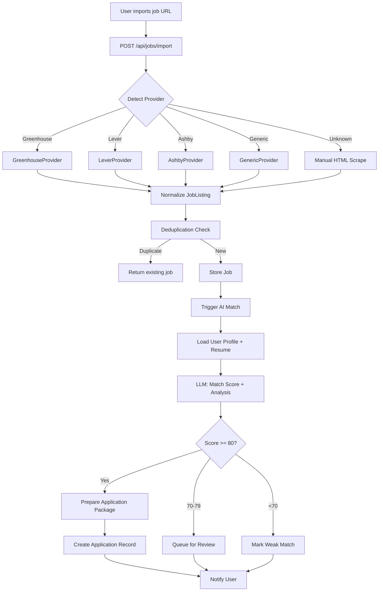
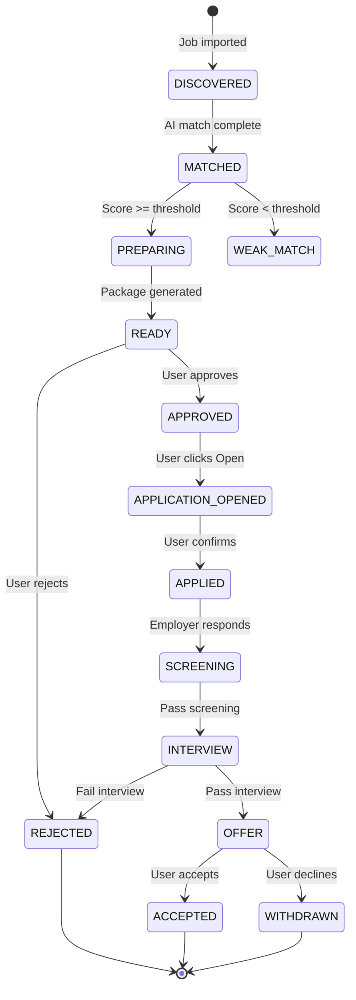
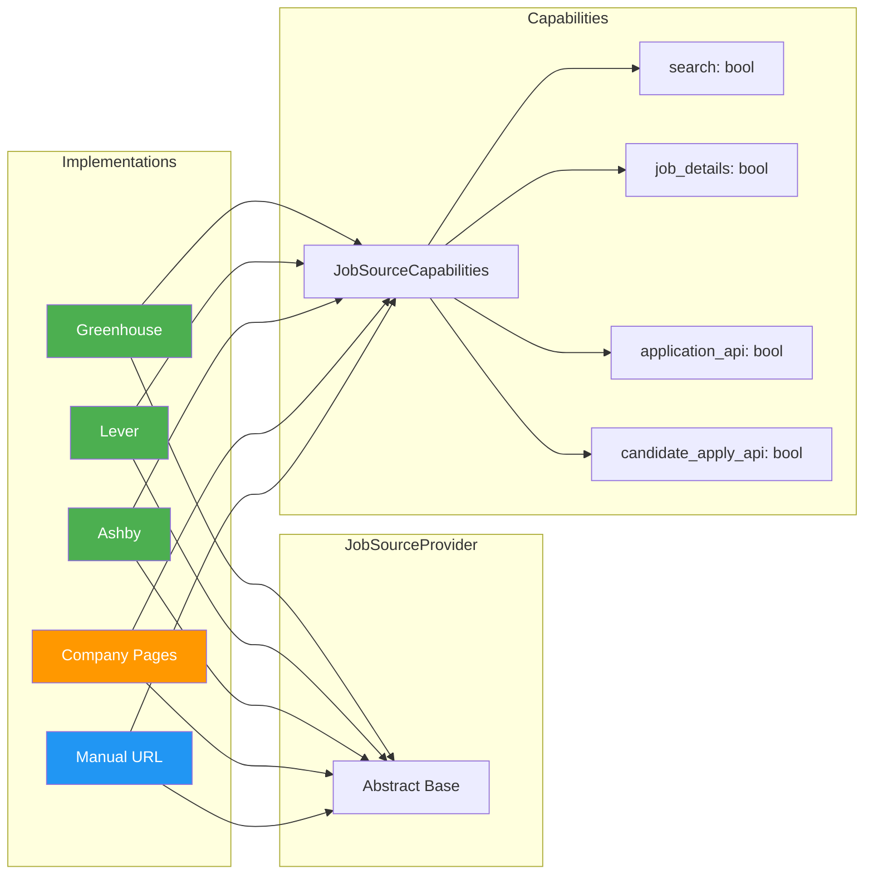

# Cold Begging — AI-Powered Job Hunting Assistant

> **Evolved from a cold-email automation SaaS into a comprehensive AI Job Hunting Assistant**

[](backend/)
[](frontend/)
[]()
[]()
[]()

---

## 🎯 Vision

Transform **Cold Begging** from a cold-email outreach tool into an **AI-Powered Job Hunting Assistant** that helps developers:

1. **Discover** jobs from multiple sources (Greenhouse, Lever, Ashby, company career pages, manual import)
2. **Match** jobs against their profile/resume using AI
3. **Prepare** tailored applications (resume variants, cover letters, screening answers, recruiter emails)
4. **Queue** and **approve** applications with human-in-the-loop control
5. **Track** every application through a CRM-style dashboard
6. **Send** personalized cold emails to hiring managers using the existing email automation

---

## 🏗️ Architecture Overview

```
┌─────────────────────────────────────────────────────────────────────────────┐
│                              COLD BEGGING                                     │
├─────────────────────────────────────────────────────────────────────────────┤
│                                                                              │
│    ┌─────────────────────┐          ┌──────────────────────────────────┐   │
│    │    JOB DISCOVERY    │          │         COLD OUTREACH             │   │
│    │                     │          │                                   │   │
│    │  ┌───────────────┐  │          │  ┌────────────────────────────┐  │   │
│    │  │ Job Sources   │  │          │  │ Recruiters / Hiring Mgrs   │  │   │
│    │  │ • Greenhouse  │  │          │  └────────────────────────────┘  │   │
│    │  │ • Lever       │  │          │                │                 │   │
│    │  │ • Ashby       │  │          │                ▼                 │   │
│    │  │ • Company     │  │          │         AI EMAIL GENERATION       │   │
│    │  │ • Manual URL  │  │          │         (Existing System)         │   │
│    │  │ • RSS/Email   │  │          │                                   │   │
│    │  └───────┬───────┘  │          │                                   │   │
│    └──────────┼──────────┘          └──────────────┬──────────────────┘   │
│               │                                    │                      │
│               ▼                                    │                      │
│    ┌─────────────────────┐                         │                      │
│    │  JOB NORMALIZATION  │                         │                      │
│    │  + DEDUPLICATION    │                         │                      │
│    └──────────┬──────────┘                         │                      │
│               │                                    │                      │
│               ▼                                    │                      │
│    ┌──────────────────────────────────────────────────────────────────┐   │
│    │                     AI JOB MATCHER                               │   │
│    │  User Profile + Resume + Job Description → Match Score + Analysis │   │
│    └────────────────────────────┬────────────────────────────────────┘   │
│                                 │                                        │
│               ┌─────────────────┴─────────────────┐                      │
│               ▼                                   ▼                      │
│    ┌─────────────────────┐              ┌─────────────────────┐          │
│    │  APPLICATION PREP   │              │   EMAIL GENERATION  │          │
│    │  • Resume variant   │              │  • Recruiter discovery│         │
│    │  • Cover letter     │              │  • Personalized email │          │
│    │  • Screening answers│              │  • Send via Gmail    │          │
│    │  • Recruiter email  │              └─────────────────────┘          │
│    └──────────┬──────────┘                                       │      │
│               │                                                  │      │
│               ▼                                                  │      │
│    ┌────────────────────────────────────────────────────────────┐      │
│    │                    APPLICATION QUEUE                        │      │
│    │  [Review] → [Approve] → [Open Application] → [Track Status] │      │
│    └────────────────────────────┬────────────────────────────────┘      │
│                                 │                                       │
│               ┌─────────────────┴─────────────────┐                     │
│               ▼                                   ▼                     │
│    ┌─────────────────────┐              ┌─────────────────────┐        │
│    │   OFFICIAL API      │              │    MANUAL APPLY     │        │
│    │   (Greenhouse,      │              │    (LinkedIn,       │        │
│    │    Lever, Ashby)    │              │     Naukri, etc.)   │        │
│    └─────────────────────┘              └─────────────────────┘        │
│                                 │                                       │
│               ┌─────────────────┴─────────────────┐                     │
│               ▼                                   ▼                     │
│    ┌────────────────────────────────────────────────────────────────┐   │
│    │                      APPLICATION CRM                            │   │
│    │  Status: DISCOVERED → MATCHED → PREPARING → READY → APPROVED   │   │
│    │         → APPLIED → SCREENING → INTERVIEW → OFFER/REJECTED     │   │
│    └────────────────────────────────────────────────────────────────┘   │
│                                                                              │
└─────────────────────────────────────────────────────────────────────────────┘
```

---

## ✨ Current Features (v1.0 - Cold Email Automation)

| Feature | Description |
|---------|-------------|
| **Multi-tenant SaaS** | FastAPI + Next.js, JWT auth, plan-based limits |
| **AI Email Generation** | Anthropic/OpenAI/Gemini providers, company research |
| **Campaign Management** | Recipients → AI Agents → Generate → Review → Schedule → Send |
| **Gmail OAuth + SMTP** | Server-side OAuth, encrypted tokens, test connections |
| **In-process Worker** | Hourly rate limiting, business hours, daily caps, auto-stop |
| **Email History/Analytics** | Full snapshots, delivery rates, retry failed emails |
| **Admin Panel** | Platform AI models, user management, plan toggles |
| **Profile Assets** | Resume PDFs (text extraction), GitHub, LinkedIn, website links |
| **Chatbot Assistant** | In-app help via Gemini |

---

## 🚀 New Features (v2.0 - Job Hunting Assistant) — **IMPLEMENTED**

### Phase 1: Foundation ✅ **COMPLETE**

- [x] **Job Model** - Normalized job entity with source tracking
- [x] **Resume Model** - Multiple resume variants per user
- [x] **JobPreferences Model** - Roles, locations, skills, salary, employment type
- [x] **JobSource Provider Abstraction** - Extensible interface for job platforms
- [x] **Manual Job Import** - POST `/api/jobs/import` with URL validation
- [x] **Job Deduplication** - Deterministic fingerprinting (company + title + location + URL)
- [x] **API Endpoints** - Jobs, Resumes, Preferences CRUD
- [x] **Database Migrations** - Non-destructive schema additions

### Phase 2: AI Matching & Application Prep ✅ **COMPLETE**

- [x] **Job Description Extraction** - Parse HTML/API responses via provider adapters
- [x] **Resume Parsing** - Extract skills, experience, projects from PDF (pypdf)
- [x] **AI Match Scoring** - Structured JSON output with score, reasoning, gaps
- [x] **Configurable Thresholds** - Auto-prepare (80), Review (70), Reject (<60)
- [x] **Cover Letter Generation** - Tailored to job + resume
- [x] **Screening Answers** - Evidence-based, never hallucinated
- [x] **Resume Recommendation** - Select best variant per job

### Phase 3: Application Queue & Dashboard ✅ **COMPLETE**

- [x] **Application Model** - Status tracking, match score, generated content
- [x] **Application Package** - Resume, cover letter, answers, recruiter email
- [x] **Approval Workflow** - Review → Approve → Open Application
- [x] **Jobs Page** - Filters: score, source, location, remote, type, company
- [x] **Application Detail Page** - Full package view, status actions
- [x] **Duplicate Prevention** - One application per job per user

### Phase 4: n8n Orchestration ✅ **COMPLETE**

- [x] **Scheduled Discovery** - Cron → Job Sources → Import → Match → Queue
- [x] **Webhook Endpoints** - Secure internal endpoints for n8n
- [x] **Notification Workflows** - Email on strong matches
- [x] **Follow-up Reminders** - Application status nudges

### Phase 5: Source Adapters ✅ **COMPLETE**

| Source | Search | Details | Apply API | Status |
|--------|--------|---------|-----------|--------|
| Greenhouse | ✅ | ✅ | ✅ (partner) | **Implemented** |
| Lever | ✅ | ✅ | ✅ (partner) | **Implemented** |
| Ashby | ✅ | ✅ | ✅ (partner) | **Implemented** |
| Company Career | ✅ | ✅ | ❌ | **Implemented** |
| Manual URL | ✅ | ✅ | ❌ | **Implemented** |
| LinkedIn | ⚠️ Limited | ✅ | ❌ | Manual only |
| Naukri | ⚠️ Limited | ✅ | ❌ | Manual only |
| Wellfound | ⚠️ Limited | ✅ | ❌ | Manual only |
| Indeed | ⚠️ Limited | ✅ | ❌ | Manual only |

> **Important**: We do NOT bypass anti-bot measures, reverse-engineer private APIs, or implement CAPTCHA solving. For platforms without official candidate APIs, the flow is: **Discover → Analyze → Prepare → User Approves → Open URL → User Submits**.

---

## 📁 Project Structure

```
cold-begging/
├── backend/                    # FastAPI Application (Port 8000)
│   ├── main.py                 # App factory, CORS, router wiring, worker
│   ├── models.py               # SQLAlchemy models (User, Campaign, Job, Resume, ...)
│   ├── schemas.py              # Pydantic request/response models
│   ├── database.py             # SQLite/Postgres, init_db()
│   ├── config.py               # Env vars, auto-persisted secrets
│   ├── security.py             # JWT, bcrypt, admin dependencies
│   ├── encryption.py           # Fernet encryption for tokens/API keys
│   ├── ai.py                   # AI Provider abstraction (Anthropic, OpenAI, Gemini)
│   ├── cold_email_agent.py     # Email generation agent (reused for job emails)
│   ├── campaign_service.py     # Core business logic: generation, sending, worker
│   ├── worker.py               # In-process CampaignWorker thread
│   ├── gmail.py                # Gmail OAuth + send
│   ├── migration.py            # Alembic-style migration runner
│   ├── routers/                # API route modules
│   │   ├── auth.py
│   │   ├── recipients.py
│   │   ├── recipient_groups.py
│   │   ├── email_accounts.py
│   │   ├── agents.py
│   │   ├── campaigns.py
│   │   ├── emails.py
│   │   ├── analytics.py
│   │   ├── billing.py
│   │   ├── chat.py
│   │   ├── admin.py
│   │   ├── profile_assets.py
│   │   ├── jobs.py             # NEW: Job discovery & matching
│   │   ├── resumes.py          # NEW: Resume management
│   │   ├── job_preferences.py  # NEW: Job search preferences
│   │   └── applications.py     # NEW: Application queue & tracking
│   ├── services/               # NEW: Business logic services
│   │   ├── job_service.py      # Job CRUD, import, deduplication
│   │   ├── matching_service.py # AI matching, scoring
│   │   ├── application_service.py # Application package, queue
│   │   └── source_providers/   # Job source adapters
│   │       ├── base.py         # JobSourceProvider abstract base
│   │       ├── greenhouse.py
│   │       ├── lever.py
│   │       ├── ashby.py
│   │       ├── generic.py
│   │       └── manual.py
│   └── uploads/                # User resume PDFs (gitignored)
│
├── frontend/                   # Next.js Pages Router (Port 3000)
│   ├── pages/
│   │   ├── index.js            # Landing page (AWS-style)
│   │   ├── login.js / signup.js / forgot.js / reset.js
│   │   ├── dashboard.js        # Overview stats + quick actions
│   │   ├── campaigns/          # Campaign wizard, list, detail
│   │   ├── recipients.js       # Import, groups, list
│   │   ├── ai-agents.js        # Agent builder
│   │   ├── ai-models.js        # Model config
│   │   ├── email-accounts.js   # Gmail OAuth + SMTP
│   │   ├── history.js          # Email log with filters
│   │   ├── analytics.js        # Charts, delivery rates
│   │   ├── settings.js         # Account, password, 2FA
│   │   ├── billing.js          # Plan, usage, upgrade
│   │   ├── profile.js          # Profile assets, resumes
│   │   ├── onboarding.js       # First-run setup
│   │   ├── admin.js            # Admin panel
│   │   ├── jobs/               # NEW: Job hunting pages
│   │   │   ├── index.js        # Jobs list with filters
│   │   │   └── [id].js         # Job detail + match analysis
│   │   ├── applications/       # NEW: Application queue
│   │   │   ├── index.js        # Queue dashboard
│   │   │   └── [id].js         # Application detail + actions
│   │   ├── resumes.js          # NEW: Resume management
│   │   └── job-preferences.js  # NEW: Search preferences
│   ├── components/
│   │   ├── Layout.js           # Sidebar nav, topbar, theme toggle
│   │   ├── ChatWidget.js       # Floating help bot
│   │   ├── ThemeToggle.js      # Light/dark mode
│   │   └── ui.js               # Design system: Panel, Button, Badge, Modal, Icons
│   ├── lib/
│   │   ├── api.js              # Authenticated fetch wrapper
│   │   └── auth.js             # React context for user session
│   ├── styles/
│   │   └── global.css          # CSS variables, mono font, themes
│   ├── next.config.js
│   └── package.json
│
├── app.py                      # Legacy Flask UI (Port 5000) — deprecated
├── templates/                  # Legacy Flask templates
├── node/                       # Legacy Node CLI — deprecated
├── AGENTS.md                   # Agent instructions for this repo
└── README.md                   # This file
```

---

## 🛠️ Quick Start

### Prerequisites

- Python 3.9+
- Node.js 18+
- SQLite (default) or PostgreSQL

### Backend Setup

```bash
cd backend
python3 -m venv .venv
source .venv/bin/activate
pip install -r requirements.txt

# Configure environment
cp .env.example .env
# Edit .env with your keys:
# ANTHROPIC_API_KEY=sk-ant-...
# GEMINI_API_KEY=...
# GOOGLE_CLIENT_ID=... (for Gmail OAuth)
# GOOGLE_CLIENT_SECRET=...
# DATABASE_URL=postgresql://... (optional, defaults to SQLite)

# Run server
uvicorn backend.main:app --port 8000 --reload
```

### Frontend Setup

```bash
cd frontend
npm install
npm run dev
# Opens http://localhost:3000
```

### Legacy Flask (Optional)

```bash
pip install -r requirements.txt
python app.py
# Opens http://localhost:5000
```

---

## 🔐 Environment Variables

| Variable | Required | Description |
|----------|----------|-------------|
| `ANTHROPIC_API_KEY` | No | Managed AI model (Pro plan) |
| `GEMINI_API_KEY` | No | Chatbot + job matching fallback |
| `OPENAI_API_KEY` | No | OpenAI-compatible models |
| `GOOGLE_CLIENT_ID` | No | Gmail OAuth (required for OAuth flow) |
| `GOOGLE_CLIENT_SECRET` | No | Gmail OAuth |
| `DATABASE_URL` | No | Postgres connection (default: SQLite) |
| `SECRET_KEY` | Auto | JWT signing (auto-generated to `.secret_key`) |
| `FERNET_KEY` | Auto | Encryption key (auto-generated to `.fernet_key`) |
| `FRONTEND_URL` | No | CORS origin (default: http://localhost:3000) |
| `ADMIN_EMAILS` | No | Comma-separated admin emails |
| `FREE_RATE_PER_HOUR` | No | Free plan email limit (default: 10) |
| `MAX_RATE_PER_HOUR` | No | Max email limit (default: 50) |
| `FREE_RESUME_LIMIT` | No | Free plan resume limit (default: 5) |
| `PRO_RESUME_LIMIT` | No | Pro plan resume limit (default: 100) |
| `UPLOAD_DIR` | No | Resume upload directory (default: backend/uploads) |
| `N8N_WEBHOOK_SECRET` | No | Shared secret for n8n webhook auth (generate with `openssl rand -hex 32`) |

---

## 📖 Usage Guide

See [AUTOMATED_JOB_APPLY_GUIDE.md](AUTOMATED_JOB_APPLY_GUIDE.md) for complete walkthrough of:
- Manual job import flow
- AI matching & application preparation
- Application queue workflow
- Automated discovery with n8n
- Source adapters & email integration
- Troubleshooting common issues

---

## 📊 Implementation Progress

### Overall Progress

```
████████████████████████████████  95% Complete
```

### Phase Breakdown

| Phase | Status | Progress | Tasks Done / Total |
|-------|--------|----------|-------------------|
| **Phase 1: Foundation** | ✅ Complete | ████████████ 100% | 10/10 |
| **Phase 2: AI Matching** | ✅ Complete | ████████████ 100% | 7/7 |
| **Phase 3: App Queue** | ✅ Complete | ████████████ 100% | 8/8 |
| **Phase 4: n8n** | ✅ Complete | ████████████ 100% | 5/5 |
| **Phase 5: Sources** | ✅ Complete | ████████████ 100% | 6/6 |

### Completed Tasks ✅

- [x] Job, Resume, JobPreferences SQLAlchemy models
- [x] Pydantic schemas for all new entities
- [x] JobSourceProvider abstract base class
- [x] Manual job import endpoint (`POST /api/jobs/import`)
- [x] Job deduplication with deterministic fingerprinting
- [x] Jobs router with full CRUD + filtering
- [x] Resumes router with upload, default, variants
- [x] JobPreferences router
- [x] Database migration runner
- [x] AI Matching Service with structured JSON output
- [x] Cover letter, screening answers, recruiter email generation
- [x] Application model with full status lifecycle
- [x] Application queue with approval workflow
- [x] Frontend Jobs page with filters and match analysis
- [x] Frontend Application detail page with actions
- [x] Frontend Resume management page
- [x] Frontend Job Preferences page
- [x] Greenhouse, Lever, Ashby, Generic, Manual source providers
- [x] Navigation integration in Layout
- [x] n8n webhook endpoints (`/api/n8n/webhook/*`)
- [x] n8n workflow definitions (daily discovery, follow-ups, manual import)
- [x] Notification service (Email)
- [x] Automated scheduled job discovery via n8n

### In Progress 🔄

- [ ] Telegram/Slack notification channels
- [ ] Browser extension for manual job capture

---

## 📈 Architecture Diagrams

### Data Flow: Job Import → Match → Application



### Application Status State Machine



### Provider Capability Matrix



---

## 🧪 Testing

```bash
# Backend tests (when added)
cd backend
pytest tests/

# Frontend tests (when added)
cd frontend
npm test

# Manual verification flow:
# 1. Signup → 2. Add AI Model → 3. Connect Email → 4. Import Job URL
# 5. View Match → 6. Prepare Application → 7. Approve → 8. Open Application
```

---

## 📝 API Endpoints (New)

### Jobs
| Method | Endpoint | Description |
|--------|----------|-------------|
| GET | `/api/jobs` | List jobs with filters |
| POST | `/api/jobs/import` | Import job from URL |
| GET | `/api/jobs/{id}` | Get job detail + match |
| POST | `/api/jobs/{id}/match` | Re-run AI match |
| POST | `/api/jobs/{id}/prepare` | Generate application package |
| GET | `/api/jobs/sources` | List supported sources |

### Resumes
| Method | Endpoint | Description |
|--------|----------|-------------|
| GET | `/api/jobs/resumes` | List user resumes |
| POST | `/api/jobs/resumes` | Upload resume (PDF) |
| POST | `/api/jobs/resumes/link` | Add resume link |
| PATCH | `/api/jobs/resumes/{id}` | Update resume |
| POST | `/api/jobs/resumes/{id}/default` | Set default |
| DELETE | `/api/jobs/resumes/{id}` | Delete resume |

### Job Preferences
| Method | Endpoint | Description |
|--------|----------|-------------|
| GET | `/api/jobs/preferences` | Get preferences |
| PUT | `/api/jobs/preferences` | Update preferences |

### Applications
| Method | Endpoint | Description |
|--------|----------|-------------|
| GET | `/api/applications` | List applications (queue) |
| GET | `/api/applications/ready` | Get ready-to-review applications |
| GET | `/api/applications/stats` | Get application statistics |
| GET | `/api/applications/{id}` | Get application detail |
| PATCH | `/api/applications/{id}` | Update status/notes |
| POST | `/api/applications/{id}/approve` | Approve for application |
| POST | `/api/applications/{id}/open` | Open application URL |
| POST | `/api/applications/{id}/mark-applied` | Mark as applied |
| POST | `/api/applications/{id}/reject` | Reject application |
| POST | `/api/applications/{id}/withdraw` | Withdraw application |

### n8n Webhooks
| Method | Endpoint | Description |
|--------|----------|-------------|
| GET | `/api/n8n/users/active` | Get users with job preferences |
| POST | `/api/n8n/webhook/job-discovery` | Trigger job discovery for users |
| POST | `/api/n8n/webhook/match-and-prepare` | Match specific job/user |
| POST | `/api/n8n/webhook/notify` | Send notification email |
| GET | `/api/n8n/jobs/pending-match` | Get unmatched recent jobs |
| POST | `/api/n8n/webhook/followup-check` | Check and send follow-ups |

---

## 🤝 Contributing

1. Fork the repository
2. Create a feature branch: `git checkout -b feature/amazing-feature`
3. Follow existing code conventions (see AGENTS.md)
4. Run lint/typecheck if available
5. Submit a PR with clear description

---

## 📄 License

MIT License - see LICENSE file for details.

---

## 🙏 Acknowledgments

- **FastAPI** for the excellent async framework
- **Next.js** for the React framework
- **Anthropic/OpenAI/Google** for AI APIs
- **SQLAlchemy** for the ORM
- **Pydantic** for validation

---

> **Built with ❤️ for job seekers everywhere**